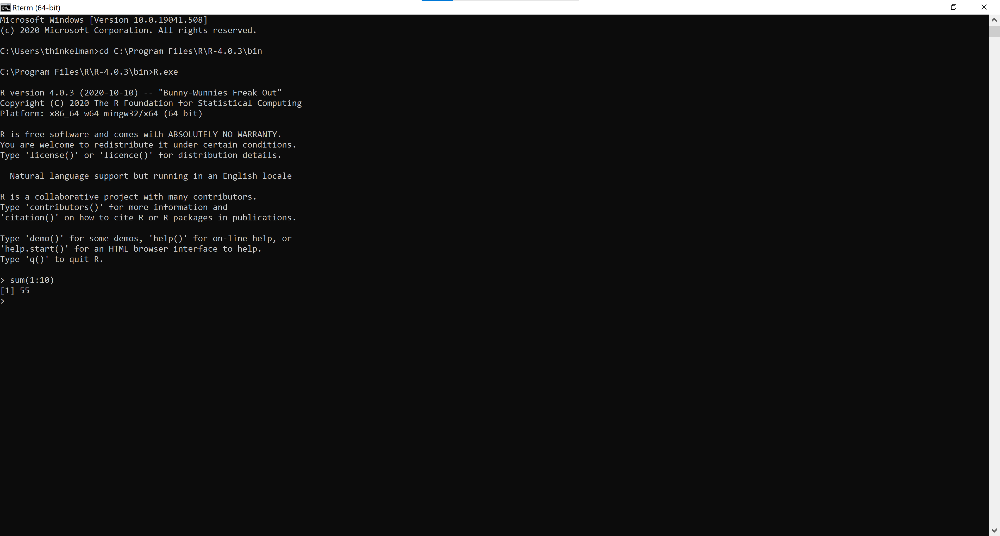
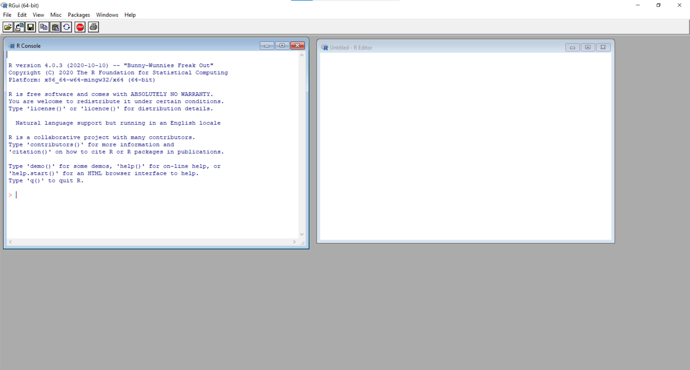
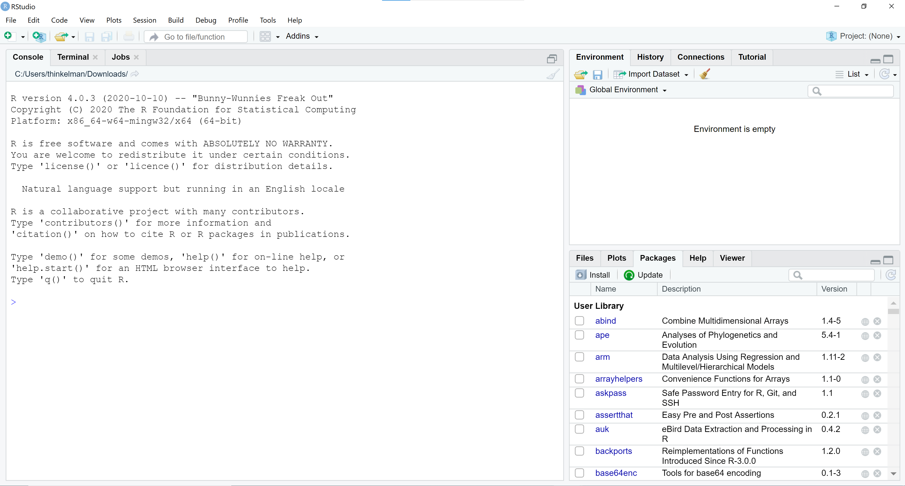
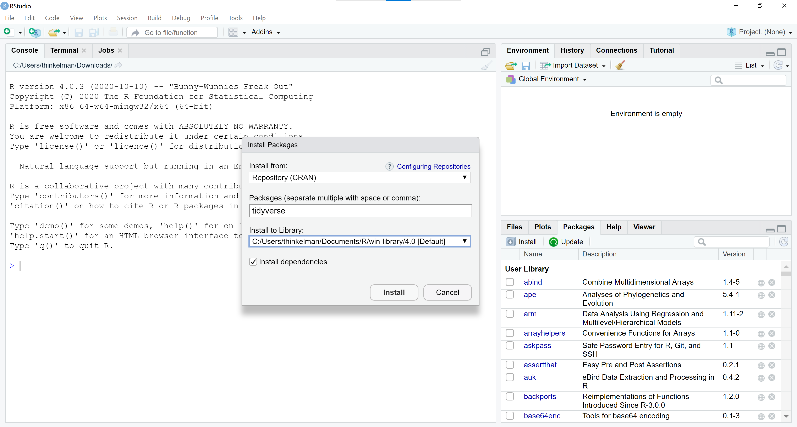
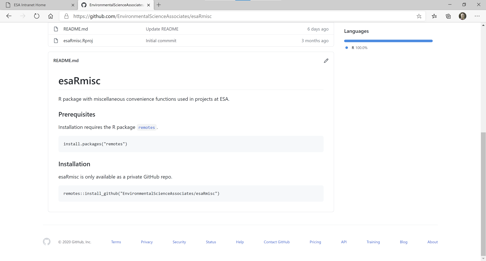
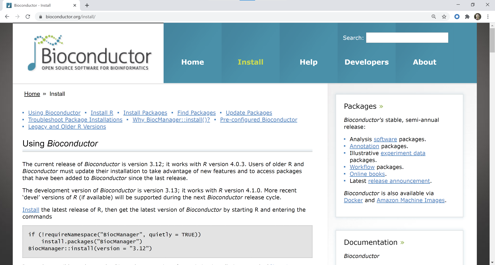
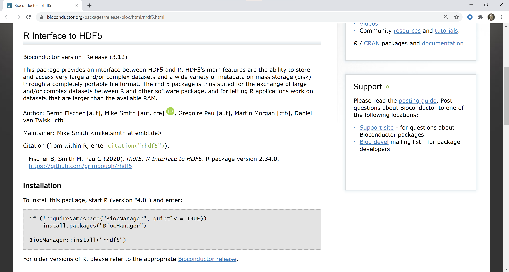
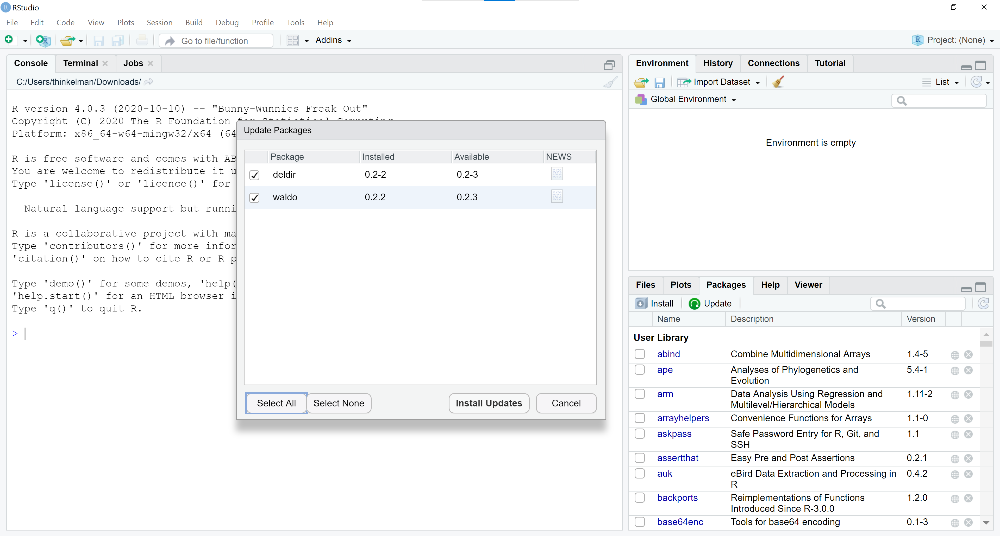
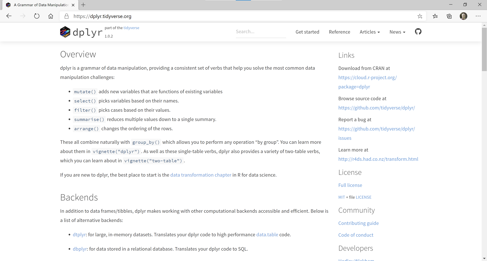

```{r setup, include=FALSE}
options(htmltools.dir.version = FALSE)
library(tidyverse)
```

```{r xaringan-themer, include=FALSE, warning=FALSE}
library(xaringanthemer)
style_duo_accent(
  primary_color = "#699CC6",
  secondary_color = "#F9A134",
  inverse_header_color = "#FFFFFF",
  extra_css = list(".title-slide" = list("background-color" = "#FFFFFF"),
                   ".title-slide, .title-slide h1, .title-slide h2, .title-slide h3" = 
                     list("color" = "#699CC6")))
```

## Motivation

.pull-left[
 
]

--

.pull-right[
  
]

---
## Motivation

.pull-left[
 

]
.pull-right[
  
]

---
## Rterm



---
## RGui



---
## RStudio



---
## R Packages


.footnote[[Epskamp 2019](https://doi.org/10.1177/2515245919847421)]

---
## Install Packages (CRAN)



---

## Install Packages (GitHub)



---

## Install Packages (Bioconductor)



---

## Install Packages (Bioconductor)



---

## Update Packages



---

## R Documentation

Quality of documentation is uneven.

Following two lines are equivalent ways to open documentation.

```{r echo = TRUE, eval=FALSE}
?mean

help("mean")
```

---

## Package Websites



---

## Data Structures

One advantage of Excel is that the data are front and center. Feels tangible.

--

Important to feel comfortable with R's functions for showing the shape and structure of your data, e.g., `length`, `dim`, `nrow`, `head`, `View`, `glimpse`, `summary`.

--

A good mental model of the shape and structure of your data helps you understand the code that you need to write to analyze that data.

--

R has four main data structures: vector, matrix/array, list, and data frame.

--

We will focus on vectors and data frames.

---

## Vectors

Combine elements into a vector with `c` (for **c**ombine or **c**oncatenate).

```{r echo = TRUE}
c(1, 2, 3)
```
--
```{r echo = TRUE}
c("a", "b", "c")
```
--
```{r echo = TRUE}
c(TRUE, FALSE, TRUE)
```
--
```{r echo = TRUE}
c("let's", "make", "a", "vector")
```

---

## Vectors

Create numeric sequences with `:` or `seq`.

```{r echo = TRUE}
1:5
```
--
```{r echo = TRUE}
seq(from = 1, to = 5, by = 1)
```
--
```{r echo = TRUE}
seq(3, 1, -0.5)
```
--
```{r echo = TRUE}
2:-3
```

---

## Vectors

Many operations in R are "vectorized."

```{r echo = TRUE}
seq(2, 10, 2) / 2
```
--
```{r echo = TRUE}
sqrt(c(1, 4, 9, 16))
```
--
```{r echo = TRUE}
c(1, 2, 3) * c(10, 11, 12)
```
--
```{r echo = TRUE}
paste0(c("flood", "dragon"), c("plain", "fly"))
```


---

## Vectors

All elements of a vector must be the same type. 

Type coercion is implicit and a common source of confusion.

--
```{r echo = TRUE}
c(1, 2, "a", "b")
```
--
```{r echo = TRUE}
c(1, 2, TRUE, FALSE)
```
--
```{r echo = TRUE}
c("a", "b", TRUE, FALSE)
```


---

## Data Frames

Data frames are tabular data structures where each column is a vector.

```{r echo = TRUE}
data.frame(Integer = 1L:3L,
           Double = c(1, 2.5, 3),
           Logical = c(TRUE, FALSE, TRUE),
           Character = c("strings", "better", "name"),
           Factor = as.factor(c("factors", "are", "special")))
```

---

## Data Frames

Examine data frame structure with `glimpse`.

```{r echo = TRUE}
d <- data.frame(Integer = 1L:3L,
                Double = c(1, 2.5, 3),
                Logical = c(TRUE, FALSE, TRUE),
                Character = c("strings", "better", "name"),
                Factor = as.factor(c("factors", "are", "special")))
glimpse(d)
```

---

## Data Frames

Elements of shorter length are recycled. Common source of confusion.

```{r echo = TRUE}
data.frame(Length4 = 1:4,
           Length2 = 1:2,
           Length1 = 1)
```

--

Recycling fails when longer vector is not a multiple of shorter vector.

```{r echo = TRUE, error=TRUE}
data.frame(Length4 = 1:4,
           Length3 = 1:3)
```

---

## Data Frames

Use `head` to preview data frame in console.

```{r echo = TRUE}
head(data.frame(x = 1:100, y = sample(1:100), z = rnorm(100)), n = 10)
```

---

## Tibbles

Tibbles are data frames with some special behavior.

```{r echo = TRUE, error=TRUE}
data.frame(Number = 1:2,
           Times2 = Number*2)
```
--
```{r echo = TRUE}
tibble(Number = 1:2,
       Times2 = Number*2)
```

---
## Tibbles

Tibbles prevent recycling of vectors to avoid surprises.

```{r echo = TRUE}
data.frame(Length4 = 1:4,
           Length2 = 1:2)
```

```{r echo = TRUE, error = TRUE}
tibble(Length4 = 1:4,
       Length2 = 1:2)
```
---

## Tibbles

By default, data frames truncate printing at 333 rows. 

Always use head if you don't know how big a data frame is.

```{r echo = TRUE, error=TRUE}
data.frame(x = 1:500, y = sample(1:500), z = rnorm(500))
```

---

## Tibbles

Tibbles have enhanced (and opinionated) printing behavior.

```{r echo = TRUE, error=TRUE}
tibble(x = 1:500, y = sample(1:500), z = rnorm(500))
```

---

## Working Directory

A key part of reading and writing data is understanding where R is looking for and putting data, respectively.

```{r echo = TRUE}
getwd()
```

--

`getwd` returns absolute paths, but using relative paths makes work more reproducible across different computers.

--

[Project-oriented workflow](https://www.tidyverse.org/blog/2017/12/workflow-vs-script/)

>If the first line of your R script is
`setwd("C:\Users\jenny\path\that\only\I\have")`  
I will come into your office and SET YOUR COMPUTER ON FIRE 🔥.  


---

## Writing Data

Datasets can be included in packages. `esaRmisc` contains a dataset with water year type classifications.

```{r echo = TRUE}
library(esaRmisc)
tail(water_year_type)
```

We can write the `water_year_type` dataset as a `CSV` file with `write_csv` and as an `XSLX` file with `write_xlsx` (but need to install `writexl` package first).

```{r echo = TRUE, eval = FALSE}
write_csv(water_year_type, "WaterYearType.csv")
writexl::write_xlsx(water_year_type, "WaterYearType.xlsx")
```

---

## Reading Data

Let's read those files back into R (but need to install `readxl` package first).

```{r echo = TRUE, eval = FALSE}
wyt_csv <- read_csv("WaterYearType.csv")
wyt_xlsx <- readxl::read_xlsx("WaterYearType.xlsx")
```

--

R can connect to and read from lots of different data sources and file types, but we will focus on flat text files (generally, `CSV`, `TSV`, or `TXT`) and Excel files (`XLSX`).

